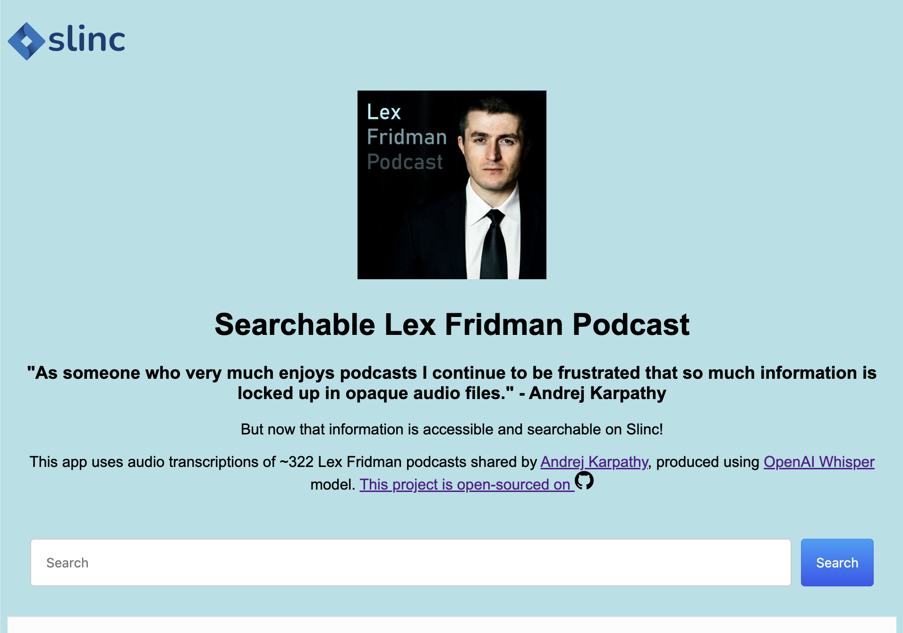

<!--  -->

  

Slinc makes knowledge from your favourite podast serachable and accessible. Currently build for Lex Fridman Podcast.  

**Hosted site** - https://slinc.netlify.app/

  

## Instructions

- This repo includes the code for the [search UI](slinc-ui) at the moment.

## TODO

- Add full pipeline to repo - [YouTube Playlist Link -> Audio extraction -> Speech-to-Text -> Document Indexing] 
- Insert episode metadata (title, description) 
- Embed links to podcast video with timestamp
- Enable semantic search

## Getting help

Please use the issues tracker of this repository to report on any bugs or questions you have.

## Contributing

I highly appreciate your contributions to this project in any amount possible. Kudle is still at an very basic stage. Suggestions on additional features and functionality are welcome. General instructions on how to contribute are mentioned in [CONTRIBUTING](CONTRIBUTING.md)